# Webpack

## 一、Webpack概念

> 教学视频 BV1MN411y7pw , P98-P118的笔记 

本质上，webpack是一个用于现代 JavaScript应用程序的**静态模块打包工具**。当webpack处理应用程序时，它会在内部从一个或多个入口点构建一个依赖图(dependency graph)，然后将你项目中所需的每一个模块组合成一个或多个bundles，它们均为静态资源，用于展示你的内容。

静态模块：指的是编写代码过程中的，html，css，js，图片等固定内容的文件。

打包：把静态模块内容，压缩，整合，转译等（前端工程化）

​	   ✓ 把 less / sass 转成 css 代码（转译）

​	   ✓ 把 ES6+ 降级成 ES5（转译）

​	   ✓ 支持多种模块标准语法（CommonJS、ECMAScript）

## 二、使用Webpack

需求：封装 utils 包，校验手机号长度和验证码长度，在 src/index.js 中使用并打包观察

> webpack本身是, node的一个第三方**模块**包, 用于打包代码。所以使用webpack之前也需要引入这个模块。

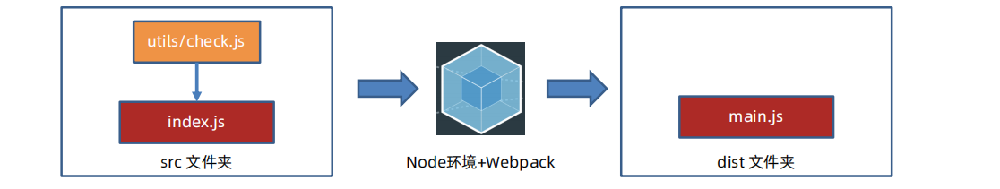

### 示例：打包

> V:\Web\mycode\webpack\01webpack_use\src\index.js

使用webpack把项目打包

① 空文件夹

② 清单文件 package.json ( npm init -y )。因为写代码的时候要用到 npm下载包

③ 编写软件包 utils（/src/utils/check.js），里面有check.js文件用于校验手机号长度和验证码长度

④ 编写项目代码，代码中使用了软件包（/src/test.js）

⑤ 准备webpack打包的环境。webpack本身是node的一个第三方软件包, 用于打包代码。所以使用webpack之前也需要引入这个包。```npm i webpack webpack-cli --save-dev```。--save-dev的意思是保存在下载到这个开发环境中。

同时在package.json中也添加了 两个软件包的相关信息。

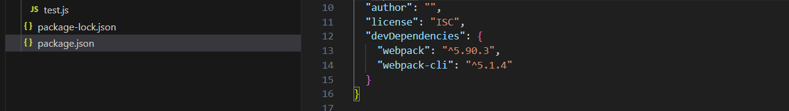

⑥ 在package.json文件中配置只属于当前项目的自定义命令。

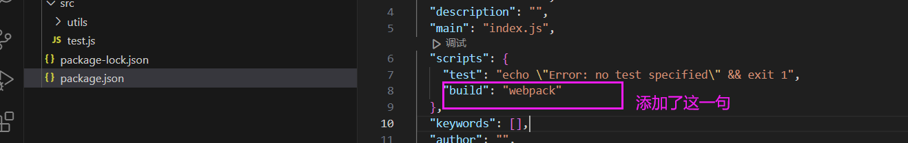

⑦ 运行自定义命令打包观察效果（npm run 自定义命令）

⑧ 如果使用了ECMA导出，就要在package.json里添加{"type": "module"}

## 三、修改 Webpack 打包入口和出口

Webpack 默认的打包入口（src/inedx.js）和出口(dist/main.js)

> [概念 | webpack 中文文档 (docschina.org)](https://webpack.docschina.org/concepts/#entry)

### 入口(entry)

默认值是 `./src/index.js`，但可以通过在 [webpack configuration](https://webpack.docschina.org/configuration) 中配置 `entry` 属性，来指定一个（或多个）不同的入口起点。例如：webpack.config.js。

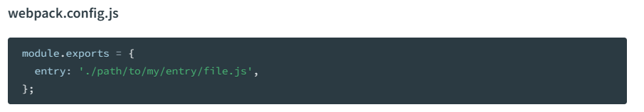

### 出口(output)

主要输出文件的默认值是 `./dist/main.js`，其他生成文件默认放置在 `./dist` 文件夹中。

你可以通过在配置中指定一个 `output` 字段，来配置这些处理过程：

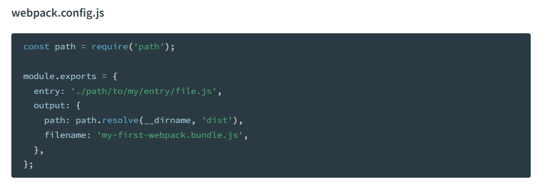

通过 `output.filename` 和 `output.path` 属性，来告诉 webpack bundle 的名称，以及我们想要 bundle 生成(emit)到哪里。

### 示例：修改入口出口

步骤：

① 项目根目录，新建 webpack.config.js 配置文件

② 导出配置对象，配置入口，出口文件的路径

③ 重新打包观察

注意：只有和入口产生直接/间接的引入关系，才会被打包


新建 webpack.config.js 配置文件，配置入口，出口文件的路径

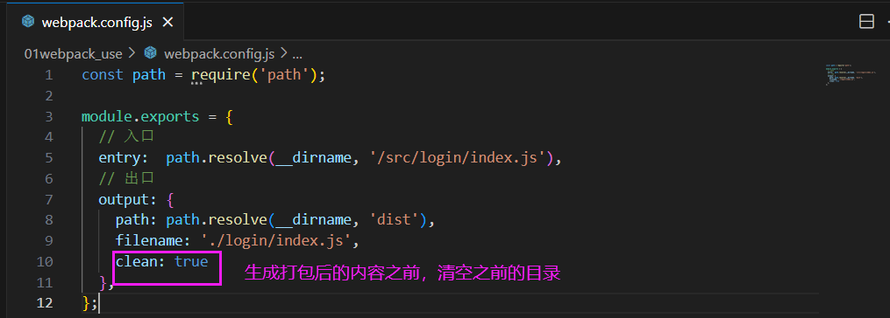

打包成功：

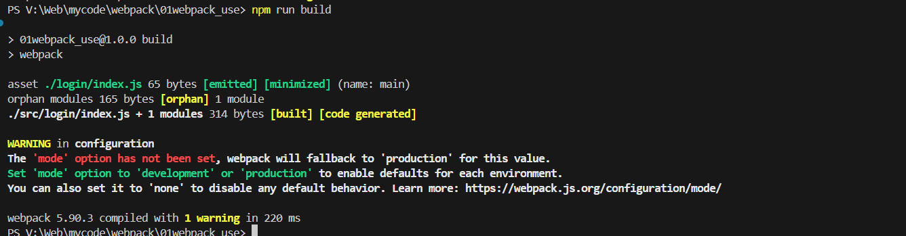

这里出了很多错，简而言之 ① package.json里不能写 "type":"module"，会导致ES6标准和CommonJS标准不兼容 ② 跟着黑马视频在 webpack.config.js 中用了 path.resolve报错，换成 path.join成功。

具体看我的这一篇博客：[《解决：黑马webpack视频中出现的问题总结》](https://blog.csdn.net/yavlgloss/article/details/136638159?csdn_share_tail=%7B%22type%22%3A%22blog%22%2C%22rType%22%3A%22article%22%2C%22rId%22%3A%22136638159%22%2C%22source%22%3A%22yavlgloss%22%7D)

## 四、示例: 登陆页面打包

> BV1MN411y7pw （P100）

新建public 文件夹，放入登陆页面 login.html，/public/login.html。在/src/login/index.js中编写登陆页面的 JS代码，通过webpack打包到dist文件之后，把 /public/login.html 复制到 /dist/login.html，并在 /dist/login.htmL 中引入 dist文件下的 JS代码。从而实现代码登录逻辑。

其中webpack在这里的用处我猜是 压缩 JS 代码。

思路核心：基于node环境和Webpack，对前端编写的代码，进行整合、翻译、打包、压缩的处理， 把打包后的代码，作用在前端网页中


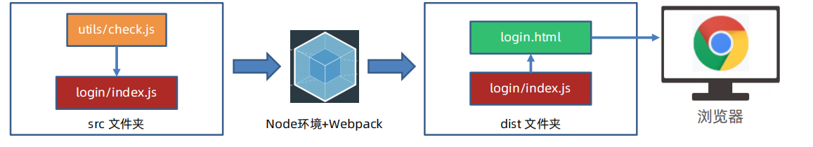

- **步骤**

① 在根目录下 新建public 文件夹，放入登陆页面 login.html

注意 对于页面 login.html 的 JS 文件，是放在 /src/login/index.js中

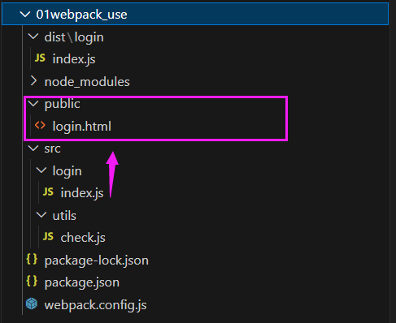

② 在/src/login/index.js中 编写登陆页面的逻辑

③ 打包

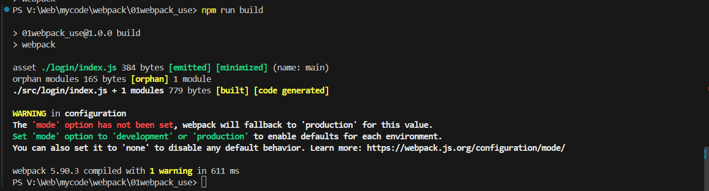

此时的页面组成为：

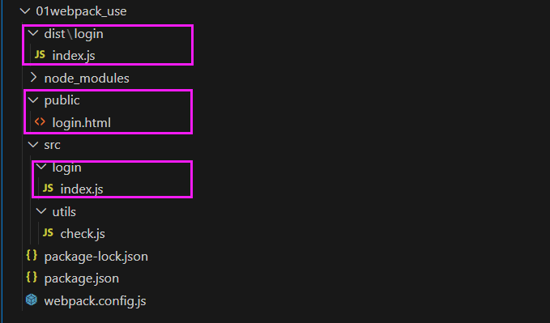

④ 把 public/login.html 复制到 dist 文件夹下，并在这里引入 dist/index.js

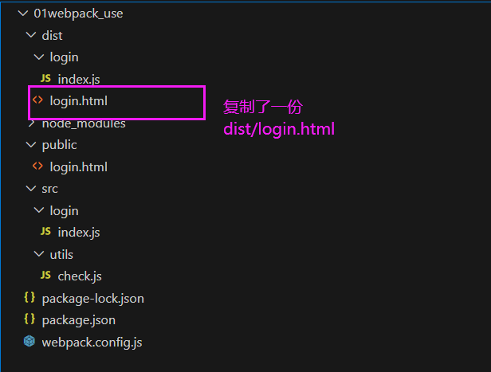

<font color="red">**dist目录下才是代码最终完成的效果。**</font>

⑤ 在浏览器中打开

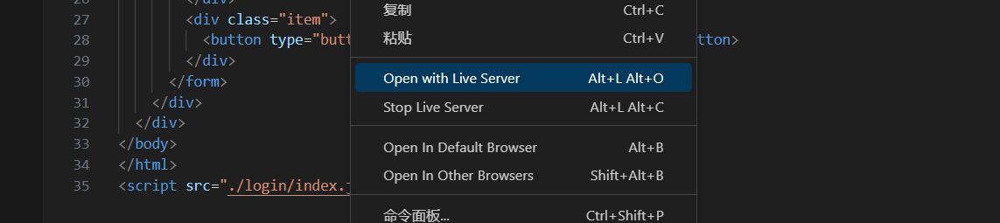


## 五、示例: 自动生成 HTML 文件

插件 html-webpack-plugin： 在 Webpack 打包时生成 html 文件

### 插件 html-webpack-plugin 文档

> 插件 html-webpack-plugin 文档：https://webpack.docschina.org/plugins/html-webpack-plugin/

- 安装

```bash
npm install --save-dev html-webpack-plugin
```

- 配置 webpack.config.js 让 Webpack 拥有插件功能

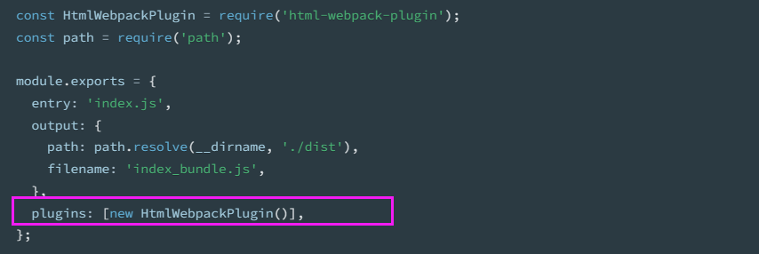

- 上一步会生成`dist/index.html` 文件

  这里dist/index.html的引入 是参照 出口 output中的， __dirname/dist/index_bundle.js

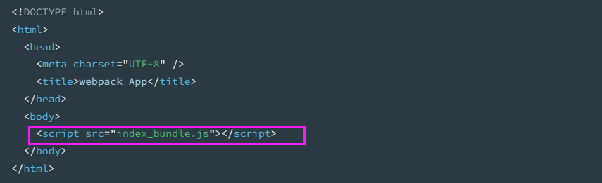

- new HtmlWebpackPlugin 中有几个参数。

  ① template：插件生成的 dist/index.html 复制哪一个文件

  ② filename:    保存在哪一个文件下


### 步骤

① 下载 html-webpack-plugin 本地软件包 ``` npm install --save-dev html-webpack-plugin``` 

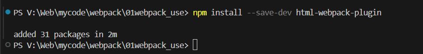

② 配置 webpack.config.js 让 Webpack 拥有插件功能

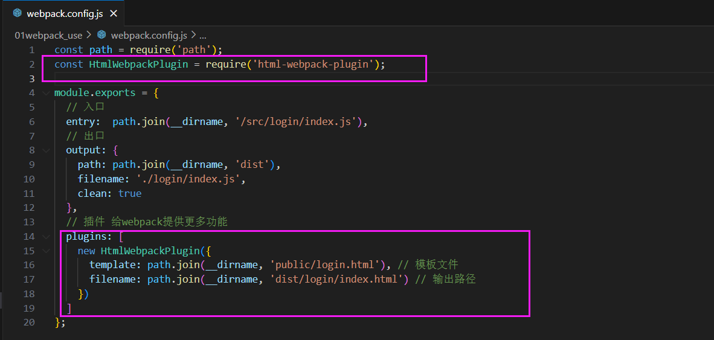

配置完，打包之后，dist/login/index.html会引入 出口路径下的 JS 文件：__dirname/dist/

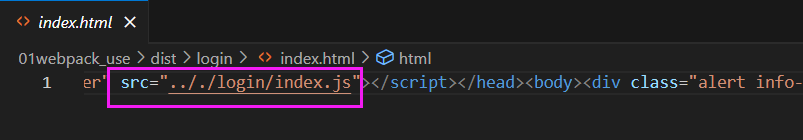

```.././login/index.js```是怎么来的：

webpack.config.js中 ```filename: path.join(__dirname, 'dist/login/index.html') // 输出路径```输出路径中，index.html的 .. 找到了 dist，通过对比发现和输出路径中的 path: path.join(__dirname, 'dist'), 一样，就拼接 output 下的 filename

```
总结
1. 下载 html-webpack-plugin 本地软件包 
2. 配置 webpack.config.js 让 Webpack 拥有插件功能
3. 重新打包观察效果
```

## 六、打包CSS代码

**注意：Webpack 默认只识别 js 代码**

<font color="red">加载器 css-loader：</font>解析 css 代码

<font color="red">加载器 style-loader：</font>把解析后的 css 代码插入到 DOM

> [css-loader | webpack 中文文档 (docschina.org)](https://webpack.docschina.org/loaders/css-loader/)
>
> [style-loader | webpack 中文文档 (docschina.org)](https://webpack.docschina.org/loaders/style-loader/)

  注：对比插件和加载器：插件让webpack有更多功能；加载器让webpack识别更多语言

### 示例：CSS加载器

①准备 css 文件代码引入到 src/login/index.js 中（压缩转译处理等）

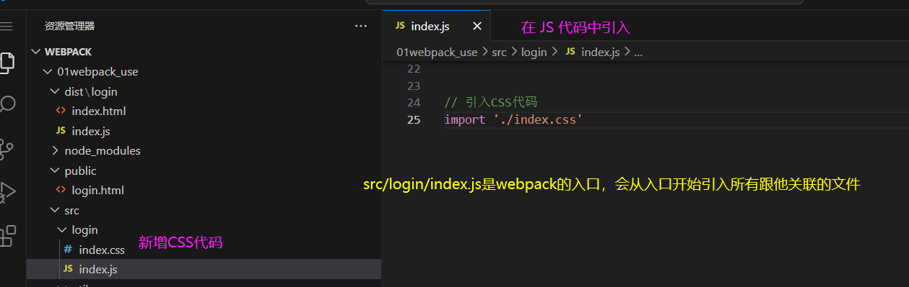

② 下载 css-loader 和 style-loader 本地软件包

```npm install --save-dev css-loader```

```npm install --save-dev style-loader```

③ 配置 webpack.config.js 让 Webpack 拥有该加载器功能

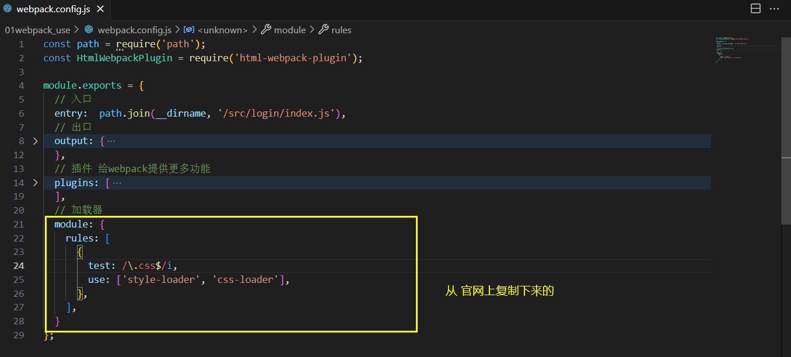

④ 打包

其中又有报错，原因是因为 只引入了css-loader ，没有引入 style-loader 

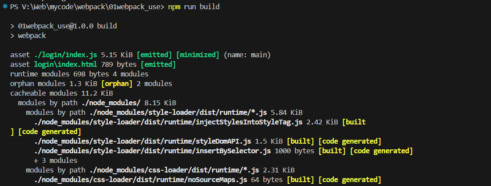

⑤  观察效果open with live server

⑥ 引入 bootstrap包

首先是 npm i bootstrap，在 src/login/ index.js中引入。```import 'bootstrap/dist/css/bootstrap.min.css'```（不清楚为什么要这么写）

然后再次打包查看效果。

### 6.1 优化-提取CSS代码

把我们打包在js文件中的代码，单独提取成一个独立的CSS文件。

好处：css 文件可以被浏览器缓存，减少 js 文件体积。浏览器可以并行下载 css和 js 的代码。

<font color="red">**插件 mini-css-extract-plugin：**</font>提取 css 代码

> 文档 https://webpack.docschina.org/plugins/mini-css-extract-plugin/

步骤：

1. 下载 mini-css-extract-plugin 本地软件包
2. 配置 webpack.config.js 让 Webpack 拥有该插件功能
3. 打包后观察效果

注意：不能和 style-loader 一起使用。因为style-loader是把CSS代码打包进JS中，并插进DOM里。

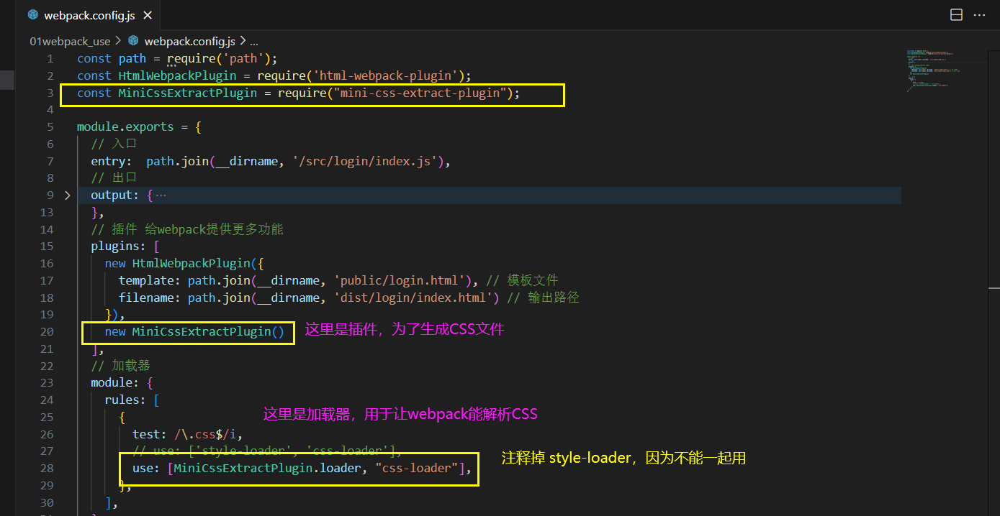

发现生成的index.html中有引入打包完成之后的 CSS文件

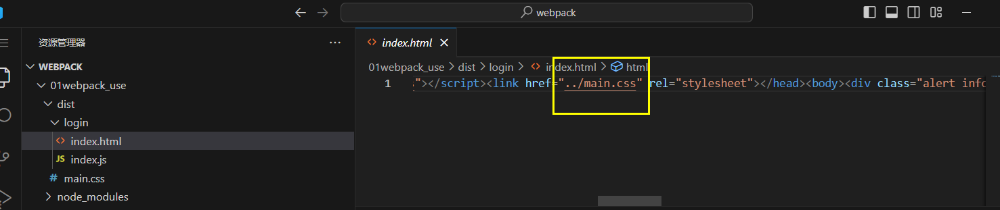

### 6.2 优化-压缩CSS代码

发现在 6.1 优化-提取CSS代码 时，我们自己的CSS并没有被压缩。

解决：使用 <font color="red">css-minimizer-webpack-plugin 插件。其实是跟6.1配套使用的，先提取出CSS代码 然后压缩。</font>

> 文档：[CssMinimizerWebpackPlugin | webpack 中文文档 (docschina.org)](https://webpack.docschina.org/plugins/css-minimizer-webpack-plugin/)

步骤：

1. 下载 css-minimizer-webpack-plugin 本地软件包 ```npm install css-minimizer-webpack-plugin --save-dev```
2. 配置 webpack.config.js 让 webpack 拥有该功能
3. 打包重新观察

## 七、打包less代码 

> [less-loader | webpack 中文文档 (docschina.org)](https://webpack.docschina.org/loaders/less-loader/)
>
> 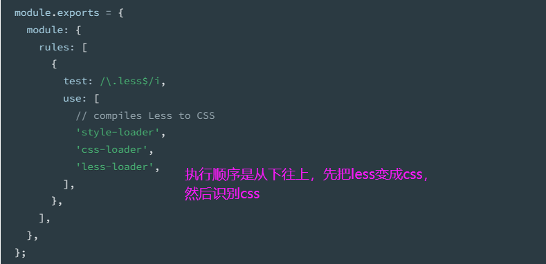
>
> 注意：style-loader和 mini-css-extract-plugin不可以一起使用

<font color="Red">加载器 less-loader：把 less 代码编译为 css 代码</font>

步骤：

1. 新建 less 代码（设置背景图）并引入到 src/login/index.js 中
2. 下载 less 和 less-loader 本地软件包
3. 配置 webpack.config.js 让 Webpack 拥有功能
4. 打包后观察效果

## 八、打包图片

**注意：Webpack 默认只识别 js 代码**

Webpack5 内置**资源模块**（字体，图片等）打包，无需额外 loader。

> 资源模块文档：https://webpack.docschina.org/guides/asset-modules/


图片在webpack中会被当做模块，但是webpack本身无法处理图片，我们需要对应的 `loader`。

- webpack5之前

当加载的图片，小于limit时会直接使用 url-loader 对图片进行加载，并将图片编译成base64的字符串形式，此时不需要一个单独的文件来存储该图片。如果加载的图片的大小 大于 limit时，需要使用file-loader，而file-loader不需要特别配置，只需要安装一下就可以了。

[《webpack对图片文件进行打包》](https://blog.csdn.net/weixin_43974265/article/details/112685888?ops_request_misc=&request_id=&biz_id=102&utm_term=webpack%E6%89%93%E5%8C%85%E5%9B%BE%E7%89%87%20&utm_medium=distribute.pc_search_result.none-task-blog-2~all~sobaiduweb~default-3-112685888.142^v99^pc_search_result_base4&spm=1018.2226.3001.4187)

- **webpack5：**

涅日治资源模块，无需额外 loader。资源模块(asset module)是一种模块类型，它允许使用资源文件（字体，图标等）而无需配置额外 loader。

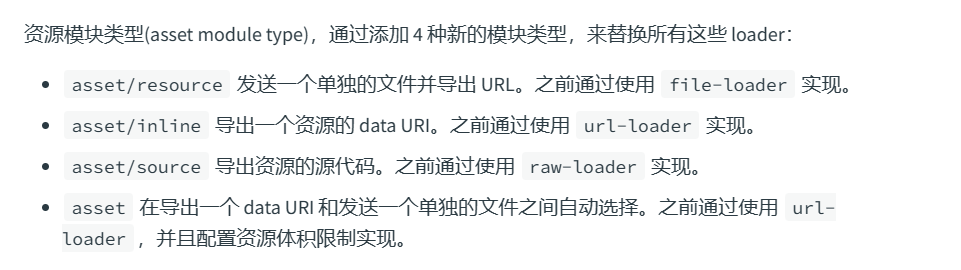

**使用步骤：**

1、配置 webpack.config.js 让 Webpack 拥有打包图片功能

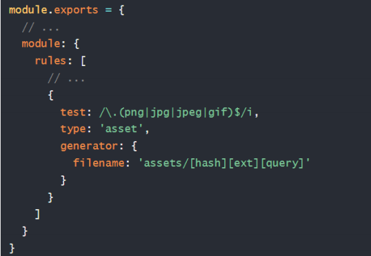

✓ 占位符 【hash】对模块内容做算法计算，得到映射的数字字母组合的字符串

✓ 占位符 【ext】使用当前模块原本的占位符，例如：.png / .jpg 等字符串

✓ 占位符 【query】保留引入文件时代码中查询参数（只有 URL 下生效）

2、打包后观察效果和区别


注意1：判断临界值默认为 8KB

✓ 大于 8KB 文件：发送一个单独的文件并导出 URL 地址

✓ 小于 8KB 文件：导出一个 data URI（base64字符串）

注意2：JS 中引入本地图片资源要用import方式（如果是网络图片 http地址，字符串可以写）

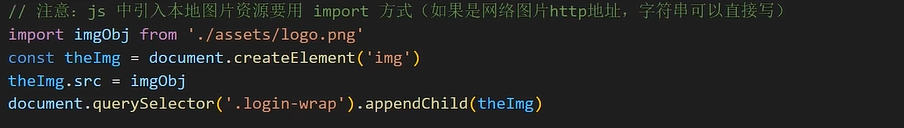

## 九、示例：axios 完成登录功能

每一个JS都是独立的，所以如果一个文件需要使用axios，就要在当前文件中引入

## 十、搭建开发环境

问题：之前改代码，需重新打包才能运行查看，效率很低。开发环境：运行在本机中，生产环境：项目上线。

<font color="Red">**开发环境：配置 webpack-dev-server 快速开发应用程序**</font>

> 文档：[开发环境 | webpack 中文文档 (docschina.org)](https://webpack.docschina.org/guides/development/)

作用：启动 Web 服务，**自动**检测代码变化，**热更新**到网页


注意：dist 目录和打包内容是在内存里（更新快）

步骤：

1. 下载 webpack-dev-server 软件包到当前项目

   ```bash
   npm install --save-dev webpack-dev-server
   ```

2. 设置模式为开发模式，并配置自定义命令

   mode: 'development' ——《webpack.config.js》

   "script": { "dev": "webpack serve --open" } ——《package.json》

3. 使用 npm run dev 来启动开发服务器，试试热更新效果

4. 注意

   注意1：webpack-dev-server借助 http模块创建8080 默认 web 服务。

   注意2：默认提供 public文件夹作为根目录。

   注意3： webpack-dev-server根据配置，打包相关代码在内存当中，以 output.path的值作为服务器根目录（所以可以直接自己拼接访问 dist目录下内容。（解决方法是在public目录下  新建一个Index、html,并强制跳转到登录页面）


### 打包模式

打包模式：告知 Webpack 使用相应模式的内置优化

> 模式 文档：https://webpack.docschina.org/configuration/mode/

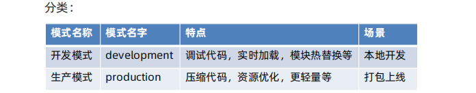

生产模式下，JS代码会极致压缩。开发模式下，JS代码会变成一段一段的模块


设置有两种方法：

方式1：在 webpack.config.js 配置文件设置 mode 选项

方式2：在 package.json 命令行设置 mode 参数

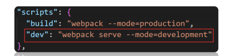

注意：命令行设置的优先级高于配置文件中的，推荐用命令行设置

#### 打包模式的应用 

需求：在开发模式下用 style-loader 内嵌更快，在生产模式下提取 css 代码。就是根据不同的打包模式，希望对CSS的处理也不一样。


方案1：webpack.config.js 配置导出函数，但是局限性大（只接受 2 种模式）

<font color="red">**方案2：借助 cross-env （跨平台通用）包命令，设置参数区分环境**</font>

**步骤：**

1. 下载 cross-env 软件包到当前项目 ```npm i cross-env --save-dev```

2. package.json  配置自定义命令，传入参数名和值（会绑定到 process.env 对象下）

   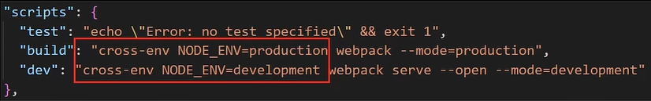

3. 在 webpack.config.js 区分不同环境使用不同配置

   process.env是node.js中内置的环境变量 对象， 通过上一步的自定义命令，我们给process.env这个对象添加了一个NODE_ENV属性。

   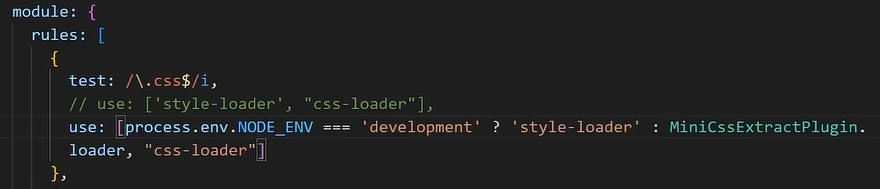

4. 重新打包观察两种配置区别

方案3：配置不同的 webpack.config.js （适用多种模式差异性较大情况）

## 十一、前端-注入环境变量

 process.env 是 Node.js 中的一个环境变量。其中保存着系统的环境的变量信息。<font color="red">向前端注入环境变量，就能让相同的代码在不同的环境下出现不同的效果。出了过滤打印的效果，还有基地址的切换（在调试的时候用本机的URL，上线之后，使用在线的数据）</font>


需求：前端项目中，开发模式下打印语句生效，生产模式下打印语句失效

问题：cross-env 设置的只在 Node.js 环境生效，前端代码无法访问 process.env.NODE_ENV 

> [DefinePlugin | webpack 中文文档 (docschina.org)](https://webpack.docschina.org/plugins/define-plugin/#root)

解决：使用 Webpack 内置的 DefinePlugin 插件

作用：在编译时，将前端代码中匹配的变量名，替换为值或表达式

## 十二、开发环境调错 - source map

问题：打包后的代码被压缩和混淆，在出错的时候无法正确定位源代码位置（行数和列数）

<font color="red">source map：可以准确追踪 error 和 warning 在原始代码的位置</font>

> [开发环境 | webpack 中文文档 (docschina.org)](https://webpack.docschina.org/guides/development/#using-source-maps)
>
> 设置：webpack.config.js 配置 devtool 选项

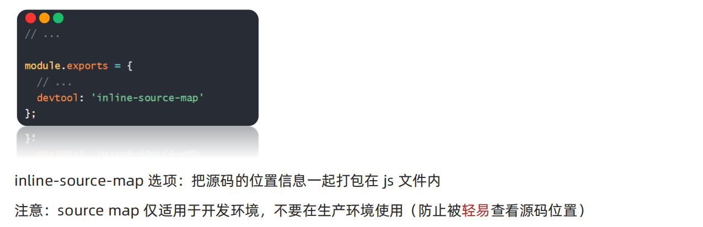

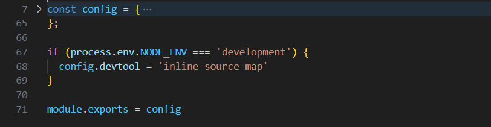

## 十三、解析别名 alias配置

解析别名：配置模块如何解析，创建 import 引入路径的别名，来确保模块引入变得更简单

例如：原来路径如图，比较长而且相对路径不安全

解决：在 webpack.config.js 中配置解析别名 @ 来代表 src 绝对路径

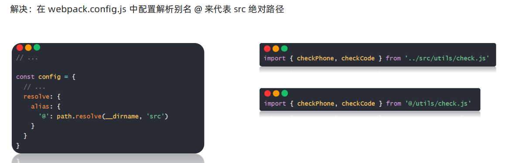

## 十四、优化：CDN使用

CDN定义：内容分发网络，指的是一组分布在各个地区的服务器

作用：把静态资源文件/第三方库放在 CDN 网络中各个服务器中，供用户就近请求获取

好处：减轻自己服务器请求压力，就近请求物理延迟低，配套缓存策略


- **示例** 

需求：开发模式使用本地第三方库，生产模式下使用 CDN 加载引入

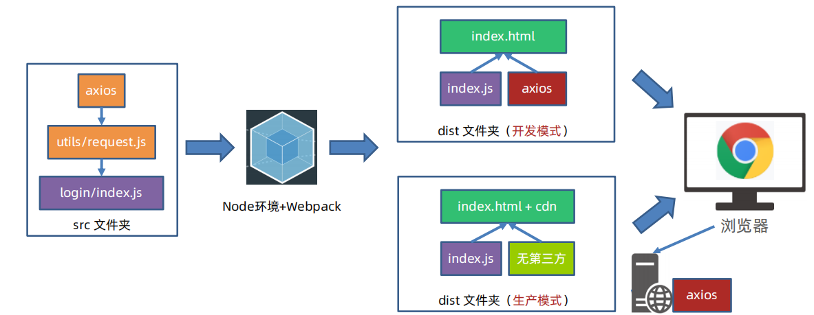

## 十五、多页面打包

单页面：单个 html 文件，切换 DOM 的方式实现不同业务逻辑展示，后续 Vue/React 会学到

多页面：多个 html 文件，切换页面实现不同业务逻辑展示


需求：把黑马头条-数据管理平台-内容页面一起引入打包使用

步骤：

1. 准备源码（html，css，js）放入相应位置，并改用模块化语法导出
2. 下载 form-serialize 包并导入到核心代码中使用
3. 配置 webpack.config.js 多入口和多页面的设置
4. 重新打包观察效果

## 十六、优化-分割公共代码

需求：把 2 个以上页面引用的公共代码提取

步骤：

1. 配置 webpack.config.js 的 splitChunks 分割功能
2. 打包观察效果

```javascript
optimization: {
    // 代码分割
    splitChunks: {
      chunks: 'all', // 所有模块动态非动态移入的都分割分析
      cacheGroups: { // 分隔组
        commons: { // 抽取公共模块
          minSize: 0, // 抽取的chunk最小大小字节
          minChunks: 2, // 最小引用数
          reuseExistingChunk: true, // 当前 chunk 包含已从主 bundle 中拆分出的模块，则它将被重用
          name(module, chunks, cacheGroupKey) { // 分离出模块文件名
            const allChunksNames = chunks.map((item) => item.name).join('~') // 模块名1~模块名2
            return `./js/${allChunksNames}` // 输出到 dist 目录下位置
          }
        }
      }
    },
}
```

